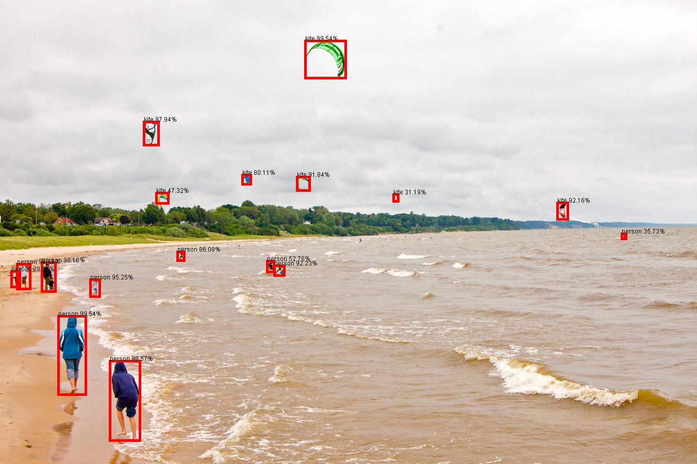

# FasterRcnnInception

Download the model from https://tfhub.dev/tensorflow/faster_rcnn/inception_resnet_v2_1024x1024/1

Unzip then untar the model to a local folder - I've used models/faster_rcnn_inception_resnet_v2_1024x1024.

Create a testimages folder then add some test images into a testimages folder

To run the example add the input image and output image as parameters:

FasterRcnnInception testimages/image2.jpg image2rcnn.jpg

### Example output
Using the image2.jpg image from https://github.com/tensorflow/models/tree/master/research/object_detection/test_images

